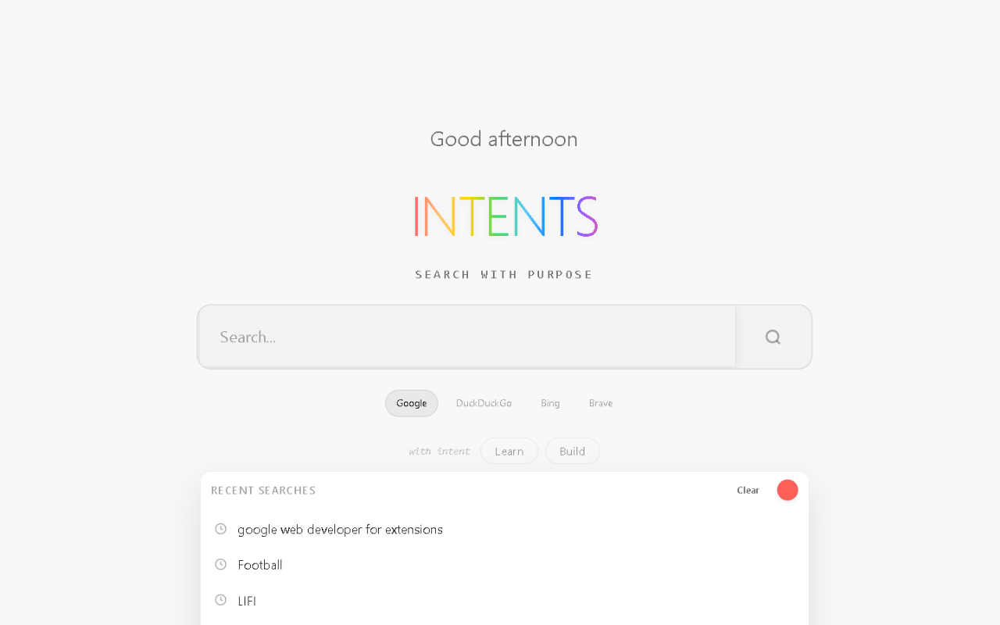
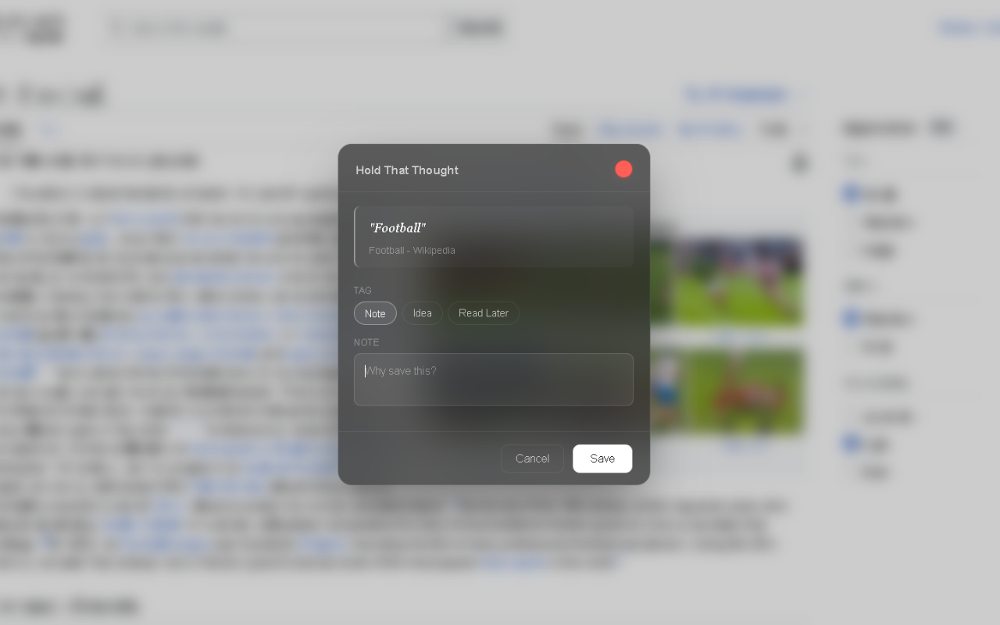
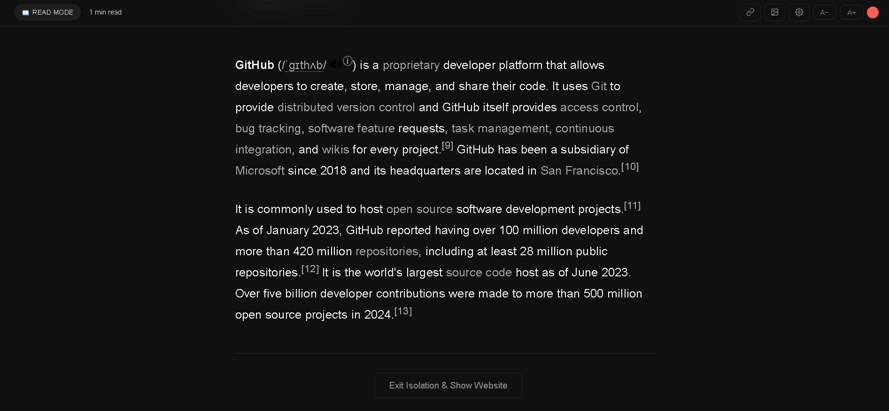
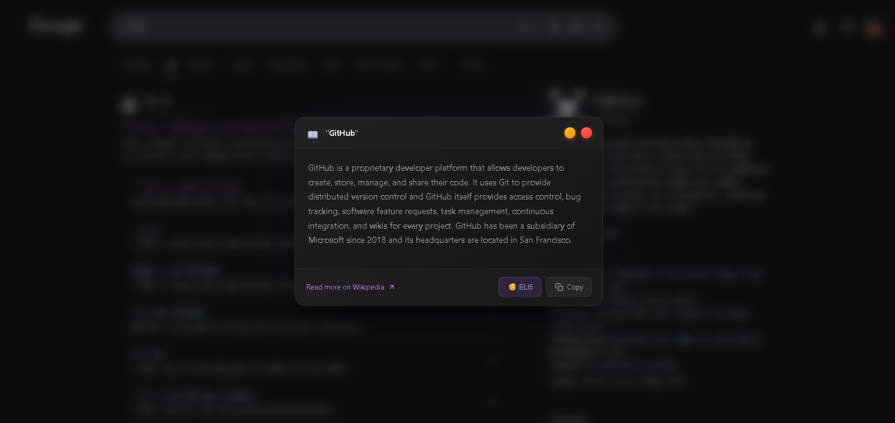
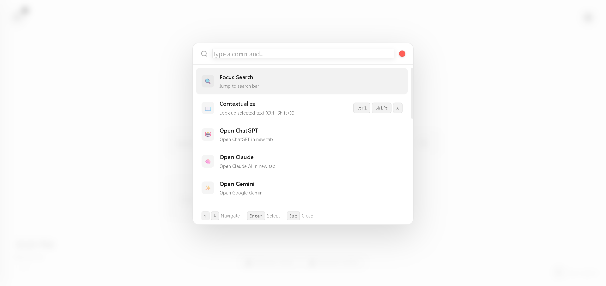

# Intents

*A calm browser layer for people who lose their train of thought.*

---

## Why Intents exists

The modern web is not built for continuity.

You open a tab for one reason, get interrupted by another, and five minutes later you’re somewhere else entirely — not because you’re careless, but because the web is optimized for **discovery**, not **memory**.

Intents exists to quietly support a different mode of browsing:
one where losing focus is expected,
derailment is not punished,
and returning to what you meant to do is effortless.

This project is not about productivity, blocking, or discipline.  
It is about **preserving intent**.

---

## What Intents is (and isn’t)

**Intents is:**
- Reactive, not intrusive
- Context-first, not task-first
- Minimal, opinionated, and local-first
- Designed for short memory, attention volatility, and cognitive overload

**Intents is not:**
- A productivity tracker
- A task manager
- A site blocker
- A search engine
- A motivational tool

It won’t tell you what to do.  
It helps you remember *why you were doing something*.

---

## Core idea

> Distraction is not a failure.  
> Losing context is the real problem.

Every feature in Intents exists to either:
- preserve context
- reduce unnecessary exits
- or help you return to your original intent

Nothing more.

---

## Features

### New Tab — a calm starting point
Intents replaces the browser’s New Tab with a minimal, quiet surface designed to feel neutral rather than demanding.

There are no quotes, streaks, or goals.  
Just a place to begin — or begin again.

*A calm starting point designed to reduce cognitive load.*

---

### Hold That Thought
While browsing, you can select any text and save it as a “thought” — optionally with your own context attached.

Later, you can return to:
- the exact page
- the exact section
- with the original text highlighted

This preserves *why* something mattered, not just *where* it was.

*Save selected text with context and return to it later, exactly where it came from.*

---

### Context ladder
Intents keeps a lightweight navigation trail during a browsing session, allowing you to see where you started and how you arrived somewhere else.

With one click, you can return to the original context instead of mentally retracing steps.

This is not history.  
It’s short-term memory support.

*A lightweight trail showing where you started and how you arrived somewhere else.*

---

### Reading / Isolate mode
For moments when you just want to read:

- Links are hidden
- Visual noise is removed
- Content is reflowed for focus

Isolate mode is temporary and reversible.  
It doesn’t block the web — it simply quiets it.

*A distraction-free reading mode that removes exits and visual noise.*

---

### Contextualise (selected-text explanations)
When you select text on a page and trigger Contextualise, Intents shows a short explanation or summary in a side panel.

This helps you understand unfamiliar terms without:
- opening new tabs
- searching
- falling into rabbit holes

If you want deeper reading, a single link can open the source in a normal tab.

*Quick explanations for selected text without leaving the page.*

---

### Commands & shortcuts
Almost everything in Intents is accessible through keyboard shortcuts.

A built-in commands panel shows all available shortcuts, keeping interaction fast and frictionless.

*A keyboard-first interface showing all available shortcuts.*

---

## Design philosophy

- Reactive, never demanding  
- Minimal over feature-rich  
- Temporary over persistent  
- Calm over clever  
- User-initiated always  

Intents assumes distraction will happen — and designs for recovery instead of prevention.

---

## Privacy & data

Intents is local-first.

- No accounts
- No analytics
- No tracking
- No telemetry
- No remote code execution

All data stays on your device.  
Optional external services (such as AI providers) are user-configured and operate under their own policies.

The source code is open so this can be verified.

---

## Open source

Intents is open source by design.

This is not because it is “perfect”, but because tools that live close to cognition should be inspectable and honest.

If you:
- have ideas
- notice issues
- want to contribute
- or just want to understand how it works

You’re welcome here.

---

## Status

Intents is actively developed, but intentionally restrained.

Not every idea belongs in the product.  
Most of the work is deciding what *not* to add.

---

## Final note

This project came from building things to solve my own attention problems — and realizing how many people quietly struggle with the same friction.

If Intents helps you feel a little less scattered,  
or helps you return to something you almost forgot,  
then it’s doing its job.
